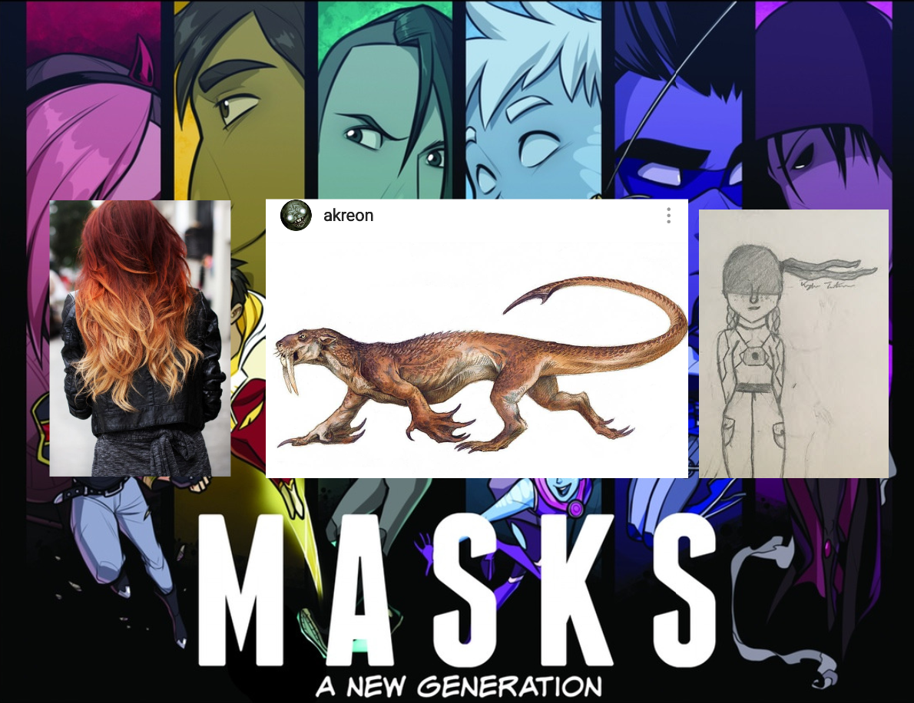
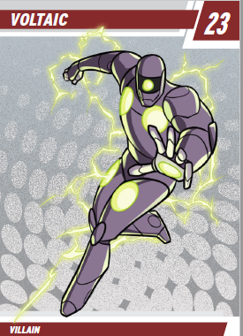
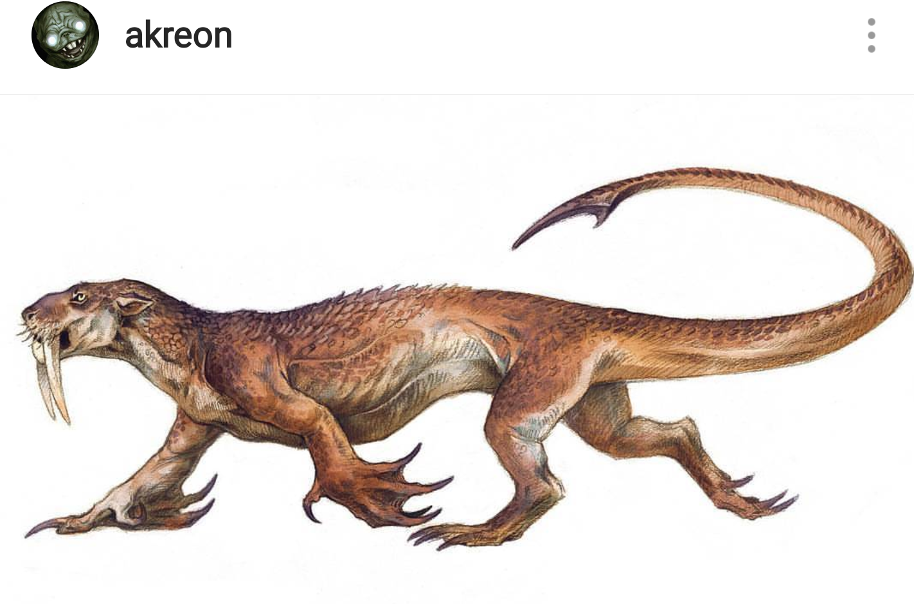
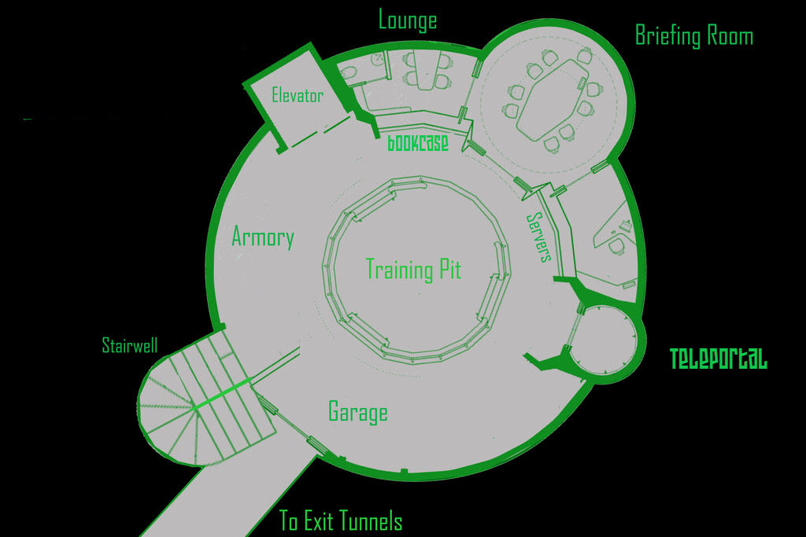

# Session 01 - Comicbook Clickbait

The team defends a crowd of Phoenix Academy students from Voltaic, while waiting for the academy ferry to come in.

Later that morning, they recover in the school infirmary, and spend lunch hour hunting down and exploring their secret base (provided by [Silhouette's](silhouette.md) mentor) under the school.

## Links

* [The Podcast Recording](http://randomaverage.com/index.php/2018/12/masks-eg-actual-play-session-01-comicbook-clickbait/)

Youtube recording - more visuals, less editing.

## Relevant imagery

