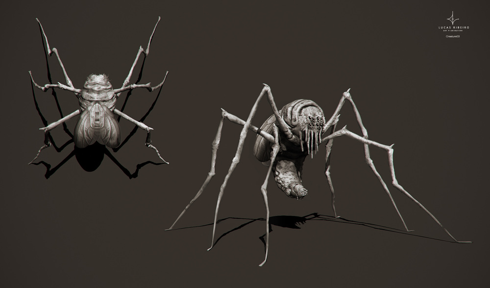

# Session 02 - Non-Frolick

We're two weeks into the school year and things are not going great for the team. Silhouette gets rocked by some disapproving teachers, AEGIS assigns a babysitter to Palacine, and Ember melts down in the cafeteria. (Not literally.)

The team then faces off against Honor Roll in a "save the hostage" scenario that goes a bit sideways, and get get a hint of badness to come.

## Links

* [The Podcast Recording](http://randomaverage.com/index.php/2018/12/masks-eg-session-2-the-non-frolick/)
* [Youtube recording - more visuals, less editing](https://youtu.be/9S3iFRrsA-Y)

## Relevant imagery

