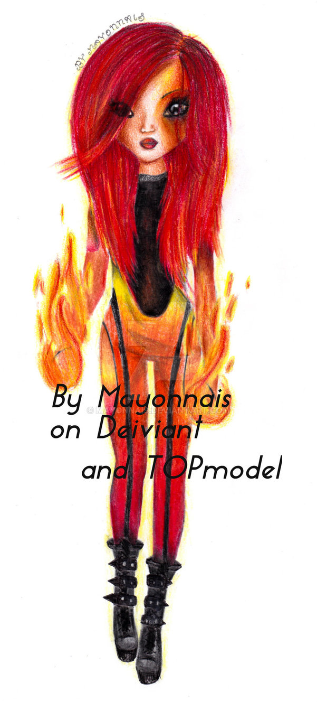
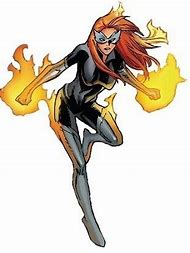

# THE NOVA

HERO NAME: Ember  
REAL NAME: Lucy Ray

**Look**
* woman, caucasian, blonde/reddish hair, blue eyes, casual clothing, and a colorful costume (black, with flames print around the wrist and ankles. Tall boots.)

## Backstory

* When did you first use your powers?
     * Only a few months ago.

* Who was the first person you accidentally hurt with your powers?
     * A bully from her old school was messing with a kid from her old school at the park, and when she stood up to him, he really got in her face and said some horrible things. She got... very mad. He just got out of the hospital a few days ago, and the bandages on his arm and leg still haven't come off. (GM notes she isn't showing any remorse about this.)

* Who, outside the team, helps you control your powers?
    * An old woman named Agatha, who saw what happened at the park.

* Why do you continue to use your powers?
    * If she doesn't use them, they build up to the point where literally ANY kind of strong emotions can release them. Using them is safer. Kind of.

* Why do you care about the team?
    * They trust her. Right now, it doesn't seem like anyone trusts her.

-----

## Inspirational Pictures

