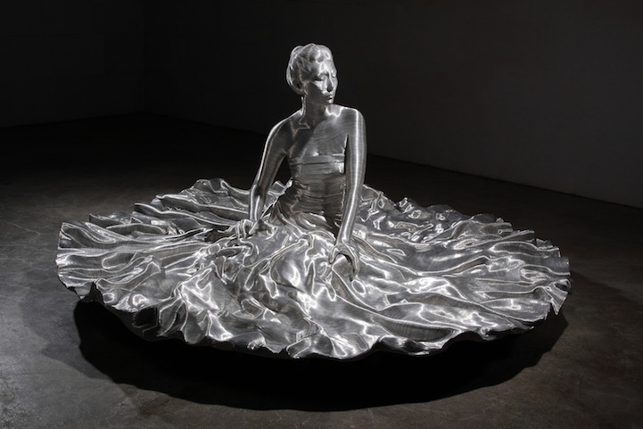
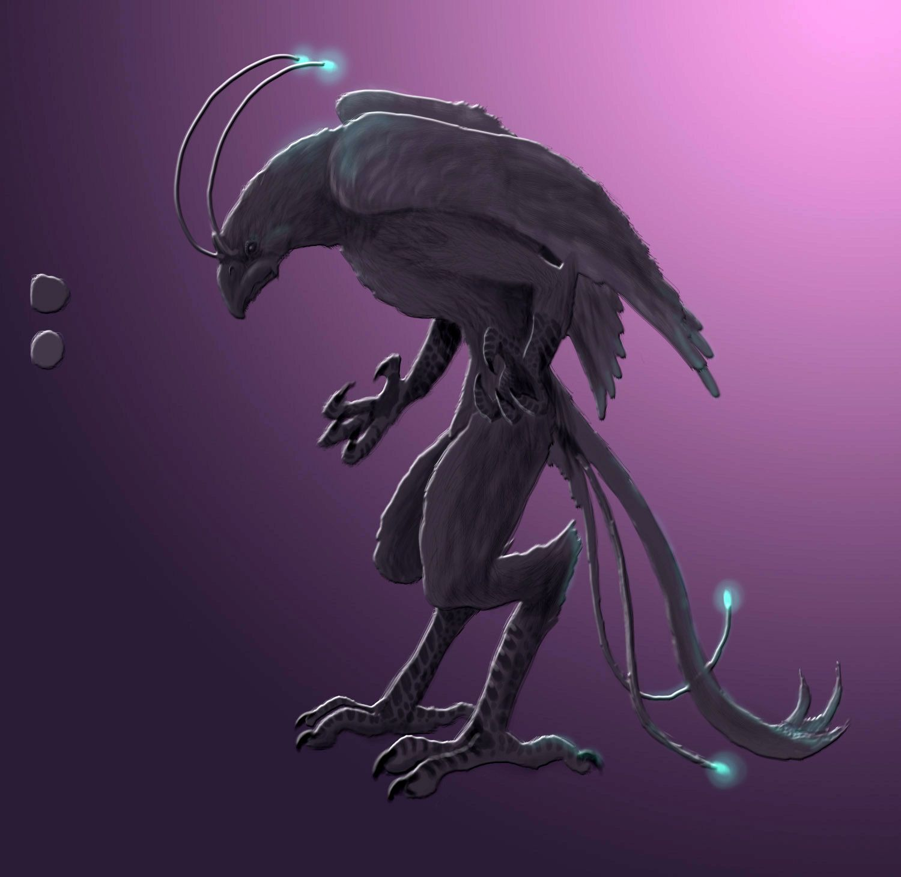
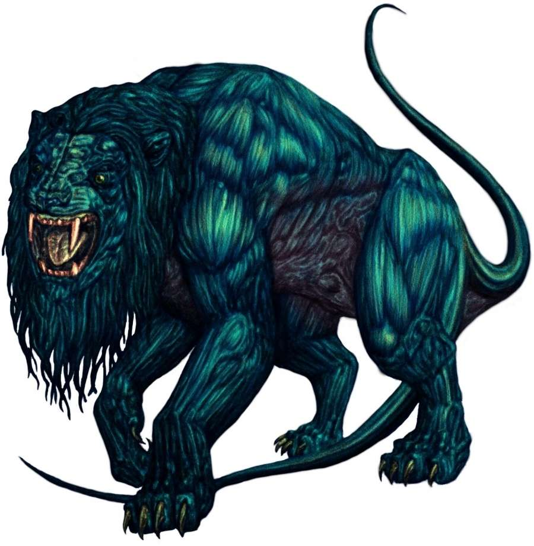
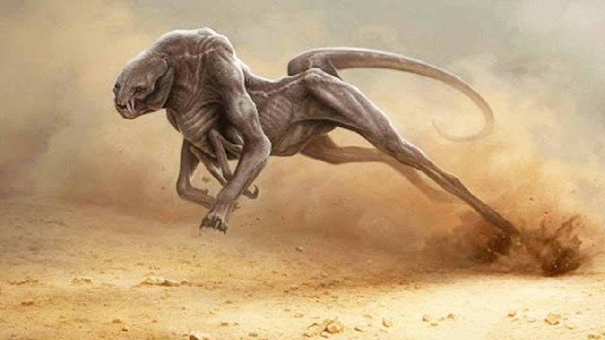
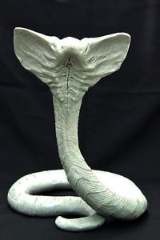

#### The Outsider

HERO NAME: Palacene (both heroic and her 'home' name)  
REAL NAME: Peggy J (She doesn't really get how names work, yet)

**Look**

* female human body (at least most of the time), metallic eyes, mismatched clothing (earth fashions are HARD), and a practical costume (which might just be her, shapeshifting something that looks like her idea of a costume)

**Abilities**
She can fly, and she's pretty tough, also:  
* radical shapeshifting  
* telepathy and mind blasts

Both the shapeshifting and telepathy are native abilities of her people.

**Backstory**

* Where do you come from?
    * Lucidia - a colorful planet with 3 suns and many moons. It's got a LOT of ocean, and is heavily affected by varying gravitational forces, so the inhabitants of the world have learned to be very... adaptable and fluid.

* Why did you come to Earth?
    * She fled or was sent away from her homeworld when it was invaded by Vanquish (a sort of intergalactic warlord, in the vein of Ronan from Gaurdians of the Galaxy). Her homeworld is peaceful, so resistance has been very slow.

* Why do you want to stay here (for now at least)?
    * It's safer here. More peaceful.

* Why do your people want you to come home?
    * I'm the princess, and the resistance needs a leader.

* Why do you care about the team?
    * My family tree is EXTENSIVE, so I really miss having a close support network.

      
      
      
      
      
      
      
