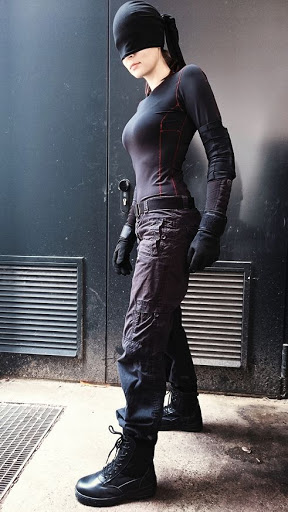

# THE PROTÉGÉ.
HERO NAME: Silhouette
REAL NAME: Casey Quinn (Casey is actually K.C., for Kendall Charity, which she hates)

**Look**

* Caucasian, female, lean body, casual clothes 
* Very simple costume consisting of combat boots, black cargo pants with some ballistic cloth lining, a sort of long-sleeved black compression mock turtleneck(same lining), and a tight, featureless black cowl.

**Abilities**
You are someone’s protégé. Your powers somewhat mimic theirs, but each of you is in some way unique.

* SHARED ABILITY: Detective skills
* YOUR OWN ABILITY: Impossible fighting skills (hyper senses)
* YOUR MENTOR’S ABILITY: telepathy/telekinesis

**Mentor**
Sil's mentor is **Vigil**, who's somewhere between Oracle and The Question for one of the city's premiere adult superhero teams. 

She does not *do* sidekicks.

Vigil EMBODIES Superior logic, and DENIES Mundane concerns.

**Backstory**
Casey wasn't born blind. Her mother died shortly after she was born, due to complications with the birth itself. Her father tried, but being a single parent was overwhelming; at some point in her early childhood, there was a bad car accident. Maybe he dozed off, maybe he was drinking. Casey tries not to think about it.

The accident blinded her, and that added complication to their lives proved too much for Casey's dad, who abandoned her to child services and a series of orphanages and foster homes.

Things were... not good, but somehow Casey's positive (albeit sarcastic), bounce-back attitude kept her going.

Then her hypersenses started developing. THAT was fun.

In a way, she was lucky - if she'd had to deal with vision on TOP of all the other sensory overload, she'd have probably gone crazy. As it was... she had a rough couple months.

(Casey could find a silver lining around a tornado.)

She'd never really been very good at people coddling her for her blindness, but now that she could somewhat function with her other heightened senses (the flipside being she had to be careful not to be overwhelmed by too much input), she decided to get away from the foster system. Since she had superpowers... she figured she'd head for Halcyon City.

It didn't take long for her to get into some trouble.

* How did you first meet your mentor?
    * Casey interrupted two street-level drug dealers beating up a third kid - a kid she knew from the local homeless shelter. Casey managed to beat the two thugs (they underestmated the wise-cracking blind girl, luckily), but never noticed the woman watching from the rooftops over the alley.  Vigil kept an eye on Casey for the next few weeks, until Casey noticed her (hypersenses, you know), at which point, Vigil vanished for a few weeks.  When she returned, it was with a stack of critiques of everything from Quinn's tactics and decision making, to her (non-existent) hand to hand technique.  Making the arrrangement official took longer, but eventually they wore each other down.

* When and why did you choose to train with them?
    * Well, she's a genius. She's a great teacher. She... also gave me a place to sleep, which is awesome. And she got me into Phoenix Academy as a freshmen, which is fantastic. And I get to be a superhero.  And I'm not alone.

* Why did they agree to train you?
    * Because I'm awesome? SHE says it's because I had tiny bit of potential and I was going to get myself killed without some training, but whatever - it's because I'm awesome.

* Who else, outside of the team, knows about your training?
    * My best friend, Maria Manuel - the biggest superhero trivia nerd who has ever lived.

* Why do you care about the team?
    * Because they never coddle me or think I need to be specially protected becuase I can't see.

Finally, Kaylee picked out her Protégé moves, with an eye toward that 'veteran'/leadership role she hoped to play.

* Been reading the files: When you first encounter an important superpowered phenomenon (your call), roll + Superior. On a hit, tell the team one important detail you’ve learned from your studies. The GM will tell you what, if anything, seems different from what you remember.  
* Captain: When you enter battle as a team, add an extra Team to the pool and carry +1 forward if you are the leader.  
* Be mindful of your surroundings: When you Assess the Situation before entering into a fight, you may ask one additional question, even on a miss.

-----

### Inspirational Pictures

